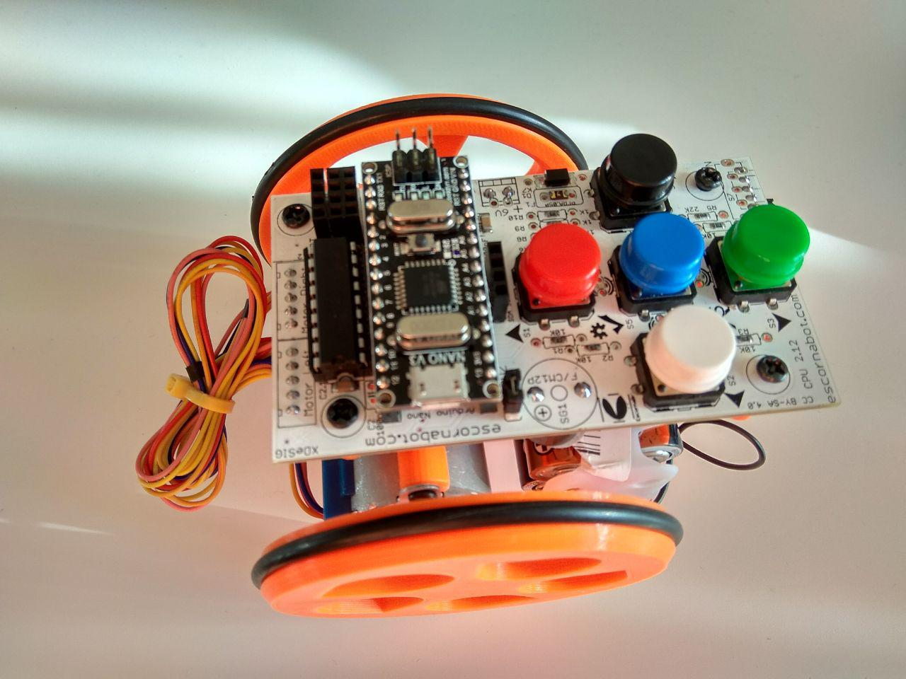

# Autoría
*Prudencio Luna* y *Pedro Ruiz*

# Aportaciones
*Jose Antonio Vacas*
*Maribel Ruiz Martínez*

# Control de Versiones
- 0.15 (16/04/2019): quinta versión, se puede mover los motores mediante procedimiento de medio paso (tipo 3) y se corrigen fallos en constructor con parámetros para elegir modos de paso.
- 0.14 (14/04/2019):cambio de nombre de procedimiento stop por Stop, se arregla procedimiento versión en .h, cambios en procedimiento pushButton, cambios en archivo de ejemplo. Limpieza de código.
- 0.13 (08/03/2017): se añade funciones driveD (mueve por distancia en cm) y turnA (gira por ángulos).
- 0.12 (28/02/2017): se cambia sentido de marcha, se facilita pasar parámetros con diccionario, se añade función ledState y traducciones varias. Se adecua archivo de ejemplo.   
- 0.11 (19/11/2017): se añade procedimiento blueT(), para conocer el dato recibido por bluetooth.
- 0.1 (8/11/2017): primera versión del programa, incorpora control de motores paso a paso (avances, retrocesos, giros, parada), elección del tipo de excitación de bobinas, control de leds, zumbador y botonera.
# Librería para arduino Escornabot
Repositorio para albergar librería para manejar de forma amigable los motores paso a paso de Escornabot.

## Antecedentes
Unos de los problemas de escornabot es la ausencia de instrucciones amigables en arduino para controlar sus elementos (motores paso a paso, botonera, leds y zumbador), todo ello pensando en el acercamiento del uso de dicho robot para estudiantes de secundaria. Por este motivo desde el club de Tecnología, programación y robótica de Granada nos planteamos desarrollar una librería para dicho fin.
## Librería
La librería debemos cargar en arduino por los métodos tradicionales, incluyendo el zip o copiandola descomprimida en la carpeta "libraries" de arduino.
### procedimientos
- **objetoEscornabot.drive (vueltas, velocidad)**: Sirve para avanzar o retroceder. Se mueve el número de vueltas indicado, si son negativas va en el sentido contrario. La velocidad se da rpm
- **objetoEscornabot.driveD (distancia, velocidad)**: Igual que el anterior pero le pasamos la cantidad de cm que queremos que se mueva.
- **objetoEscornabot.turn (vueltas, velocidad)**: Sirve para girar. Se indica como antes el número de vueltas o fracción a girar, si son positivas gira en un sentido y negativas en el contrario. La velocidad se da en rpm.
- **objetoEscornabot.turnA (angulo, velocidad)**: Igual que el anterior pero el giro se le da en grados (de 0º a 360º).
- **objetoEscornabot.Stop ()**: detiene los dos motores.
- **objetoEscornabot.ledON (número de led o posición en inglés)**: sirve para encender los leds de escornabot. Los leds son: 1 o forward (azul, posición delantera), 3 o backward (ámbar, posición trasera), 4 o right (verde, posición derecha), y 2 o left (rojo, posición izquierda).
- **objetoEscornabot.ledOFF (número de led o posición en inglés)**: sirve para apagar los leds de escornabot.
- **objetoEscornabot.ledState (número de led o posición en inglés)**: devuelve el estado del led, encendido (1 o HIGH) o apagado (0 o LOW).
- **objetoEscornabot.buzzON ()**: enciende el zumbador.
- **objetoEscornabot.buzzOFF ()**: apaga el zumbador.
- **objetoEscornabot.pushButton()**: devuelve el valor del botón pulsado o la posición en inglés. 1 o forward (delantero), 3 o backward (trasero), 4 o right (derecho), 2 o left (izquierdo), 5 o central (central).
- **objetoEscornabot.blueT()**: devuelve el valor numérico correspondiente a el carácter enviado por bluetooth a escornabot.

### Ejemplo de código de test
~~~
#include <escornabot.h>

escornabot mirobot;//por defecto funciona a modo paso completo con activación de una sóla bobina en cada paso (menor consumo y menor par)
// si ponemos mirobot(2), se activa el modo paso completo con activación de dos bobinas a la vez en cada paso (mayor consumo y mayor par)
// si ponemos mirobot(3), se activa el modo medio paso (consumo y par intermedio con los casos anteriores y movimiento más suave)

boolean led1 = false;
boolean led2 = false;
boolean led3 = false;
boolean led4 = false;
boolean buzz = false;

void setup() {
  Serial.begin (9600);
}

void loop() {
  //prueba de librería

  switch (mirobot.pushButton()) {

    case forward://si pulsamos el botón delantero, se enciende led delantero, se mueve 8 cm hacia delante, y se apaga el led delantero
      mirobot.ledON (forward);
      mirobot.driveD (8, 10);
      mirobot.ledOFF (forward);
      break;

    case backward://si pulsamos el botón trasero, se enciende led trasero, se mueve 8 cm hacia atrás, y se apaga el led trasero
      mirobot.ledON (backward);
      mirobot.driveD (-8, 10);
      mirobot.ledOFF (backward);
      break;

    case right://si pulsamos el botón derecho, se enciende led derecho, gira 45 grados hacia la derecha, y se apaga el led derecho
      mirobot.ledON (right);
      mirobot.turnA (45, 10);
      mirobot.ledOFF (right);
      break;

    case left://si pulsamos el botón izquierdo, se enciende led izquierdo, se mueve 45 grados hacia la izquierda, y se apaga el led izquierdo
      mirobot.ledON (left);
      mirobot.turnA (-45, 10);
      mirobot.ledOFF (left);
      break;

    case central://si pulsamos el botón central, suena el zumbador y se enciende todos los leds durante un segundo, después se apagan el zumbador y los leds
      mirobot.buzzON ();
      for (int i = 1; i < mirobot.numberLeds; i++)
      {
        mirobot.ledON(i);
      }
      delay (1000);
      mirobot.buzzOFF();

      for (int i = 1; i < mirobot.numberLeds; i++)
      {
        mirobot.ledOFF(i);
      }
      break;

    default://otro caso, si no pulsamos nada, no se mueve el robot
      mirobot.Stop();
      break;

  }

  switch (mirobot.blueT()) {//en función del caracter emitido por bluetooth hace varias acciones
    case 'A':
      mirobot.drive (0.25, 12);
      break;
    case 'R':
      mirobot.drive (-0.25, 12);
      break;
    case 'D':
      mirobot.turn (0.125, 12);
      break;
    case 'I':
      mirobot.turn (-0.125, 12);
      break;
    case '1':
      /*led1 = !led1;
        if (led1) {
        mirobot.ledON(forward);
        }
        else {
        mirobot.ledOFF(forward);
        }*/
      invierteLed(forward);
      break;
    case '2':
      led2 = !led2;
      if (led2) {
        mirobot.ledON(left);
      }
      else {
        mirobot.ledOFF(left);
      }
      break;
    case '3':
      led3 = !led3;
      if (led3) {
        mirobot.ledON(backward);
      }
      else {
        mirobot.ledOFF(backward);
      }
      break;
    case '4':
      led4 = !led4;
      if (led4) {
        mirobot.ledON(right);
      }
      else {
        mirobot.ledOFF(right);
      }
      break;
    case '5':
      buzz = !buzz;
      if (buzz) {
        mirobot.buzzON();
      }
      else {
        mirobot.buzzOFF();
      }
      break;
      //default:
      // statements
  }

}

void invierteLed(int i) {
  if (mirobot.ledState(i)) {
    mirobot.ledOFF(i);
  } else {
    mirobot.ledON(i);
  }
}
~~~
